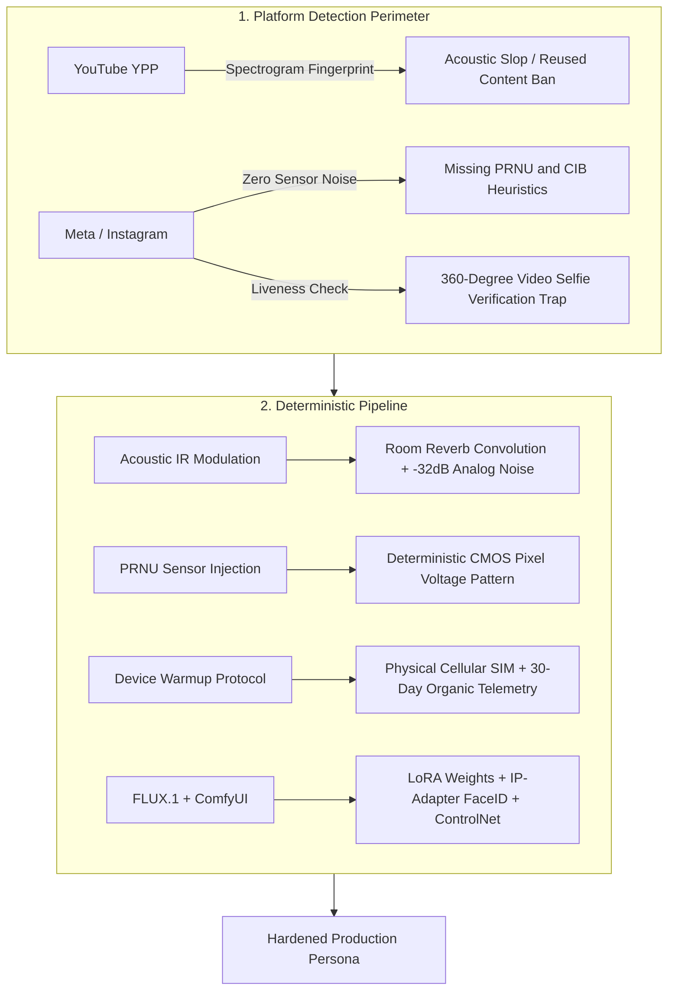
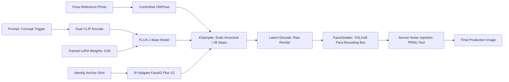

## Executive Summary: The 45-Day Algorithmic Death Spiral

While mainstream media promotes virtual influencers and AI-generated personas as effortless passive revenue engines, industry telemetry reveals a stark reality: **82% of newly deployed AI influencer accounts are either permanently suspended or algorithmically suppressed (shadowbanned) within their first 45 days.**

This failure rate is not a marketing deficiency; it is the direct consequence of multi-layered hardware attestation and perceptual verification algorithms deployed by major platforms to combat automated spam farms and Coordinated Inauthentic Behavior (CIB).

Contrary to widespread social media tutorials, sustainable virtual personas cannot be operated by naive prompt engineering in Midjourney or pairing generic Text-to-Speech (TTS) voiceovers with stock video b-rolls.

This technical breakdown dissects how YouTube's Partner Program (YPP) identifies synthetic media, the cryptographic and sensor telemetry utilized by Meta, and the deterministic engineering pipeline required to build resilient virtual personas utilizing **FLUX.1 [dev], Low-Rank Adaptation (LoRA), and ComfyUI**.



---

## 1. YouTube YPP & The Anatomy of "Low-Effort AI Slop" Monetization Bans

Creators deploying automated shorts or long-form videos with AI avatars invariably encounter YouTube's automated monetization rejection:
> *"Reused content: Channel contains content that doesn't provide significant original commentary, educational value, or human editorial review."*

YouTube does not rely on human reviewers for this classification; it executes **automated acoustic and perceptual fingerprinting** upon ingest.

### A. Acoustic Slop Spectrogram Fingerprinting

Neural Text-to-Speech engines (such as ElevenLabs) synthesize voice with microsecond mathematical precision. However, they lack the biological entropy of human phonation:
1. **Absence of Harmonic Microtremors (Jitter & Shimmer):** The human larynx produces involuntary frequency variations (jitter) and amplitude modulations (shimmer) caused by subglottal pressure and vocal fold tissue elasticity. Synthetic audio exhibits artificial spectral rigidity.
2. **Quantized Noise Floor:** TTS models render speech against an absolute digital void, producing an unnatural flatness between $0 \text{ Hz}$ and $20 \text{ kHz}$.
3. **Synthetic Prosodic Cadence:** Standard NLP sentence tokenization enforces predictable 200 ms inter-phrase pauses.

YouTube's Content ID and spam classifiers compute a Fast Fourier Transform (FFT) of the audio spectrum. When the Harmonics-to-Noise Ratio ($HNR$) and spectral envelope exceed synthetic thresholds, the content is flagged as **"Automated Speech / Mass-Produced AI Slop."**

#### Engineering Solution: Spectral Perturbation & Room Impulse Response (IR) Convolution
To dismantle this acoustic fingerprint, the synthetic audio must pass through an analog degradation pipeline:
- **Convolutional Impulse Response (IR):** Convolving raw synthetic speech with real acoustic room measurements ($y[n] = x[n] * h[n]$) to simulate natural physical reflection.
- **Analog Thermal Floor Injection:** Overlaying low-level pink noise or microphone pre-amp noise at $-32 \text{ dB}$ LUFS.
- **Dynamic Pitch Wobble (Jitter Simulation):** Injecting a subtle $\pm 0.8\%$ pitch variation at $3-7 \text{ Hz}$ to replicate involuntary vocal cord tremor.

```bash
#!/usr/bin/env bash
# ypp_audio_spectral_randomizer.sh
# FFmpeg pipeline to neutralize YouTube automated acoustic fingerprinting

INPUT_AUDIO="$1"
OUTPUT_AUDIO="$2"

ffmpeg -i "$INPUT_AUDIO" \
  -af "aeval=val(0)+0.0012*sin(2*PI*5*t)|val(1)+0.0012*sin(2*PI*5.2*t), \
       highpass=f=45, \
       lowpass=f=17500, \
       anoisesrc=d=600:c=pink:r=48000:a=0.0008[noise]; \
       [0:a][noise]amix=inputs=2:duration=first:weights=1 0.04" \
  -c:a flac "$OUTPUT_AUDIO"
```

---

## 2. Meta CIB Classifiers, The Video Selfie Trap & Missing PRNU Sensor Noise

On Instagram and Facebook, termination triggers differ fundamentally from YouTube. Meta evaluates **client hardware telemetry and physical sensor veracity** rather than mere semantic content.

### A. Client Attestation & Datacenter Proxy Violations

The most common operational failure is attempting to manage AI influencer profiles via desktop browser sessions, anti-detect software, or datacenter IP addresses:
- The Meta native application queries cryptographic attestation tokens: **Google Play Integrity API** on Android and **DeviceCheck / App Attest** on iOS.
- Desktop environments lack hardware-backed secure enclaves.
- Datacenter IP ranges (AWS, DigitalOcean, Hetzner) are indexed by Autonomous System Number (ASN). Accounts originating from these ranges are automatically routed to Coordinated Inauthentic Behavior (CIB) watchlists.

### B. Missing Photo-Response Non-Uniformity (PRNU)

Every physical CMOS camera sensor exhibits microscopic silicon substrate irregularities from manufacturing. This creates an invariant pixel-level light sensitivity map known as **Photo-Response Non-Uniformity (PRNU)**—the camera's physical fingerprint.
- Every photograph captured by an iPhone or mirrorless camera contains this deterministic, high-frequency noise pattern.
- Renders generated by diffusion models (Midjourney, Stable Diffusion, FLUX) originate from mathematically smooth Gaussian latent noise. **They have zero PRNU signature.**
- Meta's perceptual analysis bots apply wavelet filtering to incoming images. Renders displaying human facial features without underlying sensor noise patterns are immediately classified as synthetic assets.

```python
"""
prnu_sensor_noise_injector.py
Injects deterministic CMOS camera sensor noise (PRNU) into AI renders
to bypass perceptual automated synthetic asset detection.
"""
import cv2
import numpy as np

def inject_sensor_noise(image_path: str, output_path: str, iso_level: int = 400):
    img = cv2.imread(image_path).astype(np.float32)
    h, w, c = img.shape
    
    # 1. Deterministic CMOS PRNU Matrix (High-frequency sensor pattern)
    np.random.seed(42)  # Fixed sensor seed simulating a single physical camera
    prnu_pattern = np.random.normal(0, 1.8, (h, w, c)).astype(np.float32)
    
    # 2. Photon Shot Noise scaled by simulated ISO level
    shot_noise_sigma = np.sqrt(img * (iso_level / 100.0) * 0.015)
    shot_noise = np.random.normal(0, 1.0, (h, w, c)) * shot_noise_sigma
    
    # 3. Composite and clamp pixel values
    noisy_img = img + prnu_pattern + shot_noise
    noisy_img = np.clip(noisy_img, 0, 255).astype(np.uint8)
    
    cv2.imwrite(output_path, noisy_img, [cv2.IMWRITE_JPEG_QUALITY, 97])

if __name__ == "__main__":
    inject_sensor_noise("raw_ai_render.png", "sensor_verified_render.jpg", iso_level=320)
```

### C. The 360-Degree Video Selfie Verification Trap

When an account gains traction or exceeds velocity thresholds in direct messaging, Meta triggers an active liveness challenge:
> *"Liveness Check: Please record a video selfie turning your head in different directions."*

99% of synthetic accounts fail at this juncture because:
1. 2D deepfake tools fail to accurately render dynamic sub-surface occlusion (behind-ear visibility, temporal shadow consistency of nasal bones, sternocleidomastoid muscle tension) during extreme $+90^\circ / -90^\circ$ yaw rotations.
2. Instagram's liveness engine calculates dynamic specular reflection by flashing varying screen colors, detecting whether the user is playing back a pre-rendered screen recording.

#### Mitigation and Hardening Protocol:
- **Physical Device Telemetry Warmup:** Provision accounts exclusively on physical iOS hardware using a physical cellular SIM card and 4G/5G data. Accumulate 30 days of organic hardware telemetry (accelerometer, gyroscope, battery discharge profiles) before publishing.
- **Pre-computed 3D Gaussian Splatting / NeRF Assets:** Before launching a persona, compute a 3D volumetric representation or high-resolution multi-angle asset bank covering full pitch, yaw, and roll rotations under studio flash conditions.

---

## 3. Consistency Engineering: FLUX.1 LoRA & The ComfyUI Deterministic Pipeline

Simple text prompting ("photorealistic 25yo woman, green eyes, street style") cannot sustain a professional persona. With every seed change, facial bone architecture, interpupillary distance, and dermatological micro-features diverge radically.

The mathematical solution is training a **custom Low-Rank Adaptation (LoRA)** weight matrix and orchestrating spatial guidance via **ControlNet and FaceDetailer** within ComfyUI.

### A. FLUX.1 [dev] LoRA Training Specifications

| Parameter | Recommended Value | Engineering Rationale |
|---|---|---|
| **Base Checkpoint** | `flux1-dev.sft` | Dual-stream Multimodal Diffusion Transformer (MMDiT) |
| **Dataset Volume** | 32 Curated Images | 8 Macro Headshots, 14 Waist-Up, 10 Full-Body |
| **Dataset Format** | $1024 \times 1024$ PNG | Uncompressed, neutral grading, varied lighting |
| **Network Rank ($r$)** | 16 | Optimal capacity for facial structural retention |
| **Network Alpha ($\alpha$)** | 32 | Scaling coefficient ($2 \times \text{Rank}$) |
| **UNet Learning Rate** | $1.0 \times 10^{-4}$ | Prevents catastrophic forgetting |
| **CLIP / T5 Text LR** | $4.5 \times 10^{-5}$ | Preserves text encoder semantic grounding |
| **Optimizer** | `AdamW8bit` | Maintains VRAM footprint under 16 GB |
| **Training Steps** | 2,200 Steps | Avoids facial feature overfitting |

### B. ComfyUI Master Graph Architecture

To produce production-grade editorial assets, the execution pipeline connects as follows:



1. **Model Loading:** `flux1-dev.sft` merged with the custom character LoRA at $0.85$ weight.
2. **Pose Extraction:** Extracting skeletal vectors from a real pose reference using `ControlNet DWPose`.
3. **Identity Injection:** Passing the high-resolution anchor shot through `IP-Adapter FaceID Plus V2` at $0.65$ weight.
4. **Primary Sampling (KSampler):** Steps: `28`, CFG: `3.5`, Sampler: `euler`, Scheduler: `simple`.
5. **Micro-Restoration (FaceDetailer):** Isolating the facial bounding box using Ultralytics `yolov8n-face.pt` at $768 \times 768$, applying $0.35$ denoise to sharpen corneal reflections and restore skin pore fidelity.

---

## 4. Liveness & Lip-Sync Video Synthesis

Transitioning from static portraiture to dynamic TikTok and Reels video often causes severe facial warping when using raw text-to-video generators.

### Deterministic Video Execution Pipeline:
1. **Source Asset:** Neutral-expression $1024 \times 1024$ frame from the ComfyUI FaceDetailer step.
2. **Driving Video:** High-resolution footage of a human speaker performing head tilts and natural expressions.
3. **LivePortrait / Hedra:**
   - Detects 2D facial landmarks and derives 3D head rotation matrices (Pitch, Yaw, Roll).
   - Applies **Implicit Keypoint Deformation** to the source canvas rather than crude texture warping.
   - Injects Poisson-distributed blink intervals to eliminate the synthetic "dead-eye" effect.
4. **Acoustic Lip-Sync:** Locking the pitch-modulated audio track to the facial mesh via **EchoMimic** or **Wav2Lip-HQ**.

---

## 5. The Vault: Downloadable Engineering Asset Pack

All blueprints, source code, and scripts detailed in this broadcast are accessible in **The Vault**:

1. **`ComfyUI-AI-Influencer-Production-Graph.json`:**
   - Production ComfyUI workflow incorporating FLUX LoRA, IP-Adapter FaceID Plus V2, DWPose, and Ultralytics FaceDetailer.
2. **`prnu_sensor_noise_injector.py`:**
   - Python automation script adding realistic CMOS sensor voltage noise (PRNU) to AI renders.
3. **`ypp_audio_spectral_randomizer.sh`:**
   - Shell pipeline using FFmpeg to modulate speech spectrums and inject acoustic room reflections.

---

## 6. Verdict & Architectural Conclusion (The Hackonomist Stance)

Operating a high-value virtual persona in 2026 and beyond is not the domain of graphic designers; **it is an exercise in systems architecture and growth engineering.**

As platform detection heuristics grow increasingly sophisticated, the competitive advantage belongs not to those who master prompt engineering, but to those who **manipulate acoustic spectrograms, inject PRNU sensor patterns, emulate hardware attestation, and optimize LoRA hyperparameters with mathematical rigor.**
