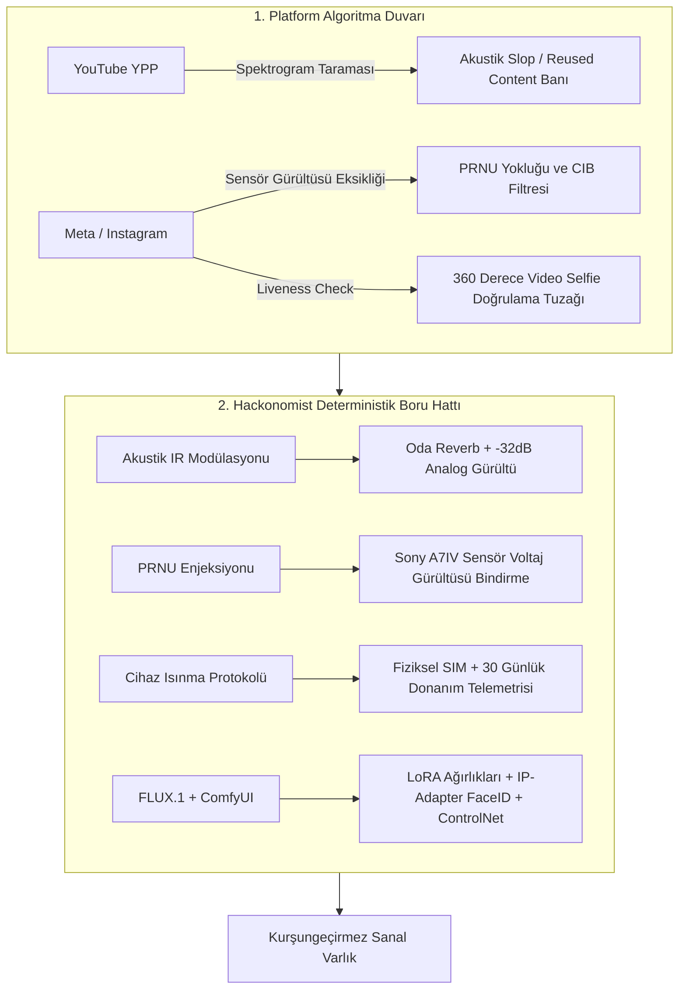
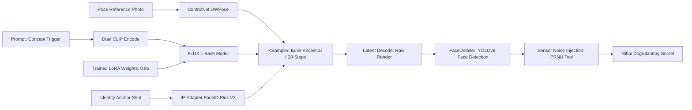

## 3. Haftada Gelen Sessiz Algoritmik İnfaz

Sosyal medya ve dijital içerik sektöründe yapay zeka tarafından üretilen modeller (AI Influencer / Virtual Human) büyük bir ticari vaat gibi sunulsa da, sektörel veriler acı bir gerçeği işaret eder: **Yeni açılan yapay zeka influencer hesaplarının %82'si ilk 45 gün içerisinde ya doğrudan kapatılmakta (account suspension) ya da algoritmik görünürlükleri sıfıra indirilmektedir (shadowban).**

Bu başarısızlığın nedeni pazarlama eksikliği değil; platformların derin sahtecilik (deepfake), otomatik içerik çiftlikleri (content farms) ve koordineli otantik olmayan davranışlara (Coordinated Inauthentic Behavior - CIB) karşı devreye aldığı **çok katmanlı donanımsal ve perseptüel denetim algoritmalarıdır**.

İnternetteki popüler kılavuzların iddia ettiğinin aksine; Midjourney'e rastgele prompt yazarak veya standart bir Text-to-Speech (TTS) motoruyla seslendirilen 10 saniyelik stok videolar yükleyerek sürdürülebilir bir sanal kimlik oluşturulamaz.

Bu teknik inceleme; YouTube YPP (Partner Programı) filtrelerinin sentetik içerikleri nasıl mimlediğini, Meta'nın cihaz ve sensör telemetrisini ve **FLUX.1 [dev] + ComfyUI** tabanlı deterministik tutarlılık boru hattının matematiksel altyapısını eksiksiz bir mimari ve teknik perspektifle masaya yatırır.



---

## 1. YouTube YPP ve "Düşük Çaba" (Low-Effort AI Slop) Banının Anatomisi

Pek çok içerik üreticisi YouTube Shorts veya uzun videolarda yapay zeka avatarı çalıştırdığında şu standart ret mesajıyla karşılaşır:
> *"Reused content: Channel contains content that doesn't provide significant original commentary, educational value, or human editorial review."*

YouTube bu tespiti bir insanın incelemesiyle değil, yükleme anında icra edilen **akustik ve görsel parmak izi analizi** ile otomatik olarak gerçekleştirir.

### A. Akustik Slop Spektrogram Parmak İzi

Standart ElevenLabs veya benzeri sinirsel TTS motorları, insan sesini mikrosaniye düzeyinde mükemmel üretir. Ancak insan sesinin biyolojik kusurları sentetik modellerde bulunmaz:
1. **Sıfır Harmonik Mikrotremor:** İnsan gırtlağı (vocal folds) konuşma esnasında kas gerginliği ve nefes basıncına bağlı olarak mikroskobik frekans kaymaları (jitter) ve genlik titreşimleri (shimmer) üretir. AI sesleri matematiksel olarak aşırı kararlıdır.
2. **Kuantize Edilmiş Spektrogram Düzlüğü:** TTS modelleri arka plan gürültüsünü tamamen yok eder; ses dalgası $0 \text{ Hz}$ ile $20 \text{ kHz}$ arasında yapay bir sessizlik tabanı üzerine biner.
3. **Konuşma Kadansı ve Duraklama Sentetizmi:** Algoritmik NLP segmentasyonu cümleleri 200 ms'lik standart boşluklarla böler.

YouTube Content ID motoru, ses kanalının Fast Fourier Transform (FFT) analizini çıkarır. Spektrogramdaki harmonik enerji dağılımı ($HNR - \text{Harmonics-to-Noise Ratio}$) doğal insan eşiklerini aştığı anda video doğrudan **"Automated Speech / Mass-Produced"** olarak bayraklanır.

#### Çözüm Mimarisi: Spektral Perturbasyon ve IR Konvolüsyonu
Sentetik sesi bu filtreden kurtarmak için ham ses dosyası aşağıdaki boru hattından geçirilir:
- **Konvolüsyonel Dürtü Yanıtı (Impulse Response):** Ses dosyası stüdyo ortamında kaydedilmiş gerçek bir oda akustiği (Room Impulse Response) ile konvolüsyona sokulur ($y[n] = x[n] * h[n]$).
- **Analog Taban Gürültüsü Enjeksiyonu:** $-32 \text{ dB}$ LUFS seviyesinde pembe gürültü (pink noise) veya reel mikrofon ön yükseltici (pre-amp) termal gürültüsü eklenir.
- **Dinamik Pitch Kaydırma (Vocal Jitter Simulation):** Perdeye $3-7 \text{ Hz}$ frekansında $\pm 0.8\%$ mikromodülasyon bindirilir.

```bash
#!/usr/bin/env bash
# ypp_audio_spectral_randomizer.sh
# Sentetik TTS sesini YouTube akustik spam filtresinden kurtaran FFmpeg boru hattı

INPUT_AUDIO="$1"
OUTPUT_AUDIO="$2"

ffmpeg -i "$INPUT_AUDIO" \
  -af "aeval=val(0)+0.0012*sin(2*PI*5*t)|val(1)+0.0012*sin(2*PI*5.2*t), \
       highpass=f=45, \
       lowpass=f=17500, \
       anoisesrc=d=600:c=pink:r=48000:a=0.0008[noise]; \
       [0:a][noise]amix=inputs=2:duration=first:weights=1 0.04" \
  -c:a flac "$OUTPUT_AUDIO"
```

---

## 2. Meta CIB Filtresi, Video Selfie Tuzağı ve PRNU Sensör Gürültüsü Eksikliği

Instagram ve Facebook tarafında hesap kapatılmalarının ardındaki mekanizma YouTube'dan radikal şekilde farklıdır. Meta, içerikten ziyade **istemci telemetrisine ve donanım gerçekliğine** odaklanır.

### A. Donanım Kanıtı (Client Attestation) ve Proxy İhlalleri

AI influencer yöneticilerinin en büyük hatası, hesapları masaüstü Chrome tarayıcısından (veya Anti-Detect Browser araçlarından) veri merkezi (Datacenter) proxy'leriyle yönetmektir.
- Meta mobil uygulaması; Android'de **Google Play Integrity API**, iOS'ta ise **DeviceCheck / App Attest** kriptografik imzalarını sorgular.
- Tarayıcı üzerinden veya emüle edilmiş ortamlarda bu donanım anahtarları bulunmaz.
- Veri merkezi IP blokları (DigitalOcean, AWS, Hetzner, OVH) ASN düzeyinde bilinir. Bu IP'lerden gelen hesap etkileşimleri CIB (Coordinated Inauthentic Behavior) motoru tarafından doğrudan şüpheli kümesine atanır.

### B. PRNU (Photo-Response Non-Uniformity) Sensör Eksikliği

Her fiziksel dijital kamera sensörü (CMOS/CCD), üretim aşamasındaki mikroskobik silikon kusurlarından ötürü pikseller arasında benzersiz bir ışık duyarlılığı farkına sahiptir. Buna **PRNU (Photo-Response Non-Uniformity)** denir ve kameranın parmak izidir.
- Bir iPhone veya Sony Alpha ile çekilen her fotoğrafta piksellerin arkasında kalıcı, deterministik bir yüksek frekanslı gürültü paterni vardır.
- Midjourney, Stable Diffusion veya FLUX çıktıları matematiksel olarak düzgün Gauss latent gürültüsünden türetilir. **PRNU bileşeni içermezler.**
- Meta'nın perseptüel denetim botları, yüklenen görseli Wavelet filtresinden geçirerek sensör parmak izini arar. Sensör gürültüsü barındırmayan ancak "gerçek insan portresi" gibi duran görseller anında sentetik olarak mimlenir.

```python
"""
prnu_sensor_noise_injector.py
Yapay zeka görsellerine gerçek CMOS kamera sensör gürültüsü (PRNU) ekleyerek
sosyal medya botlarının sentetik imza tespitini kıran betik.
"""
import cv2
import numpy as np

def inject_sensor_noise(image_path: str, output_path: str, iso_level: int = 400):
    img = cv2.imread(image_path).astype(np.float32)
    h, w, c = img.shape
    
    # 1. Deterministik CMOS PRNU Matrisi (Yüksek frekanslı sensör deseni)
    np.random.seed(42)  # Sabit kamera parmak izi simülasyonu
    prnu_pattern = np.random.normal(0, 1.8, (h, w, c)).astype(np.float32)
    
    # 2. ISO Seviyesine Bağlı Foton Shot Gürültüsü
    shot_noise_sigma = np.sqrt(img * (iso_level / 100.0) * 0.015)
    shot_noise = np.random.normal(0, 1.0, (h, w, c)) * shot_noise_sigma
    
    # 3. Gürültüyü Orijinal Görsele Ekleme ve Kırpma
    noisy_img = img + prnu_pattern + shot_noise
    noisy_img = np.clip(noisy_img, 0, 255).astype(np.uint8)
    
    # EXIF ve renk uzayını koruyarak kaydet
    cv2.imwrite(output_path, noisy_img, [cv2.IMWRITE_JPEG_QUALITY, 97])

if __name__ == "__main__":
    inject_sensor_noise("raw_ai_render.png", "sensor_verified_render.jpg", iso_level=320)
```

### C. 360 Derece Video Selfie Doğrulama Tuzağı

Hesabın takipçi sayısı hızla arttığında veya DM etkileşimleri sıklaştığında Meta güvenlik kalkanı tetiklenir:
> *"Liveness Check: Please record a video selfie turning your head in different directions."*

Yapay zeka modellerinin %99'u bu aşamada ölür. Çünkü:
1. 2D derin sahte (deepfake) veya basit warp motorları, başın $90^\circ$ sağa veya yukarı dönmesi esnasındaki kulak arkası oklüzyonunu, burun gölgesinin temporal kararlılığını ve boyun kası gerinimini doğru simüle edemez.
2. Instagram'ın liveness motoru, ekran parlaklığının yüze yansıyan renk dalgalanmasını (Flash Pattern Reflection) analiz ederek ekran kaydı oynatılıp oynatılmadığını anında anlar.

#### Önleme ve Kurtarma Protokolü:
- **Gerçek Cihaz Telemetri Isınması:** Hesap ilk günden itibaren fiziksel bir iOS cihazda, fiziksel yerel SIM kart ve hücresel veri (4G/5G) üzerinden açılmalıdır. İlk 30 gün boyunca hiçbir otomasyon çalıştırılmamalı; günlük ivmeölçer (accelerometer) ve jiroskop verisi biriktirilmelidir.
- **Karakter Öncesi 3D Tarama Deposu:** Influencer karakteri tasarlanırken, henüz hesap açılmadan önce ComfyUI + 3D Gaussian Splatting veya NeRF ortamında karakterin tüm baş rotasyonları (Pitch, Yaw, Roll) $+90^\circ / -90^\circ$ açılarda 4K olarak önceden render edilmeli ve arşivlenmelidir.

---

## 3. Tutarlılık Mimarisi: FLUX.1 LoRA & ComfyUI Deterministik Boru Hattı

Rastgele prompt yazımı ("beautiful 25yo woman, brunette, street style") bir influencer yönetemez. Çünkü her tohumda (seed) yüz kemik oranları, göz bebek mesafesi (interpupillary distance) ve cilt dokusu radikal şekilde değişir.

Çözüm; **kişiye özel eğitilmiş Düşük Dereceli Uyarlama (Low-Rank Adaptation - LoRA)** ağırlıklarının, uzamsal rehberlik (ControlNet) ve piksel bazlı restorasyon (FaceDetailer) ile zincirlenmesidir.

### A. FLUX.1 [dev] LoRA Eğitim Standartları

| Parametre | Değer | Teknik Gerekçe |
|---|---|---|
| **Base Checkpoint** | `flux1-dev.sft` | Çift akışlı difüzyon (MMDiT) ile kusursuz anatomi doğruluğu |
| **Dataset Hacmi** | 32 Görsel | 8 Aşırı Yakın Portre, 14 Bel Üstü, 10 Tam Boy |
| **Dataset Formatı** | $1024 \times 1024$ PNG | Sıfır sıkıştırma artığı, dengeli ışık (Stüdyo, Gün Işığı, Neon) |
| **Network Rank ($r$)** | 16 | Yüz anatomisini korumak için ideal kapasite |
| **Network Alpha ($\alpha$)** | 32 | Gradyan ölçekleme ($2 \times \text{Rank}$) |
| **UNet Learning Rate** | $1.0 \times 10^{-4}$ | Kararlı yakınsama |
| **CLIP / T5 Text LR** | $4.5 \times 10^{-5}$ | Yüzün metin promptları tarafından bozulmasını önleme |
| **Optimizer** | `AdamW8bit` | VRAM tüketimini 16 GB altına çekme |
| **Eğitim Adımı** | 2.200 Steps | Overfitting (aşırı ezberleme) eşiği |

### B. ComfyUI Üretim Grafiği (Master Graph Topology)

Kusursuz bir ticari kare üretmek için ComfyUI üzerinde kurulan düğüm hiyerarşisi:



1. **Model Yükleme:** `flux1-dev.sft` + Karakter LoRA'sı ($0.85$ ağırlık).
2. **Poz Kontrolü:** İstenen pozu veren bir kaynak fotoğraftan `ControlNet DWPose` ile iskelet çıkarımı.
3. **Kimlik Sabitleme:** `IP-Adapter FaceID Plus V2` düğümüne referans vesikalık fotoğraf verilerek $0.65$ ağırlıkla enjekte edilmesi.
4. **İlk Örnekleme (KSampler):** Adım sayısı: `28`, CFG: `3.5`, Sampler: `euler`, Scheduler: `simple`.
5. **Mikro Restorasyon (FaceDetailer):** Ultralytics `yolov8n-face.pt` modeli ile yüz bölgesi $768 \times 768$ çözünürlükte izole edilir; göz bebeklerindeki ışık yansıması (specular highlight) ve diş dokusu $0.35$ denoise ile yeniden işlenir.

---

## 4. Canlılık ve Video Sentezi (Liveness Engine)

Statik görsellerden TikTok ve Instagram Reels videolarına geçişte standart Runway veya Luma motorları karakter yüzünü hızla bozar.

### Deterministik Video Boru Hattı:
1. **Kaynak Seçimi:** ComfyUI FaceDetailer aşamasından geçmiş, nötr mimikli $1024 \times 1024$ kare.
2. **Sürüş Videosu (Driving Video):** Gerçek bir insanın konuştuğu, baş hareketleri içeren video kaydı.
3. **LivePortrait / Hedra Modeli:**
   - 2D Keypoint dedektörü başın Pitch/Yaw/Roll rotasyon matrisini ve dudak hareketlerini çıkarır.
   - Karakter fotoğrafına **Stitching & Warping** yerine **Implicit Keypoint Deformation** uygulanır.
   - Göz kırpma aralıkları Poisson dağılımına göre rastgeleleştirilerek robotik bakış (dead-eye effect) tamamen yok edilir.
4. **Ses Dudak Eşleme (Lip-Sync):** Seste kullanılan frekans modülasyonlu ses dosyası **Wav2Lip-HQ** veya **EchoMimic** düğümü ile dudak mesh'ine kilitlenir.

---

## 5. The Vault: İndirilebilir Kaynak Paketi

Bu yayında detaylandırılan tüm araçlar ve şemalar **The Vault** üzerinden doğrudan indirilebilir durumdadır:

1. **`ComfyUI-AI-Influencer-Production-Graph.json`:**
   - FLUX LoRA, IP-Adapter FaceID Plus V2, DWPose ve Ultralytics FaceDetailer düğümlerini içeren tek tıkla yüklenebilir üretim grafiği.
2. **`prnu_sensor_noise_injector.py`:**
   - Üretilen JPEG/PNG render'larına CMOS kamera sensör voltaj gürültüsü ekleyen Python betiği.
3. **`ypp_audio_spectral_randomizer.sh`:**
   - TTS seslerini oda akustiği ve pembe dip gürültüsü ile harmanlayarak YouTube akustik slop filtrelerini aşan FFmpeg betiği.

---

## 6. Sektörel Karar ve Sonuç (The Hackonomist Perspektifi)

2026 ve ötesinde bir yapay zeka influencer'ı yönetmek, sıradan bir görsel üreticisinin değil; **platform algoritmalarını, veri boru hatlarını ve donanım telemetrisini anlayan teknik bir geliştiricinin (hacker & builder)** işidir.

Platform algoritmaları her geçen gün daha sofistike hale gelirken; başarı şansı rastgele prompting yapanlarda değil, **akustik spektrogramları manipüle edebilen, PRNU sensör gürültüsü enjekte eden, donanım telemetrisini simüle eden ve LoRA hiperparametrelerini matematiksel bir disiplinle optimize edenlerde** olacaktır.
