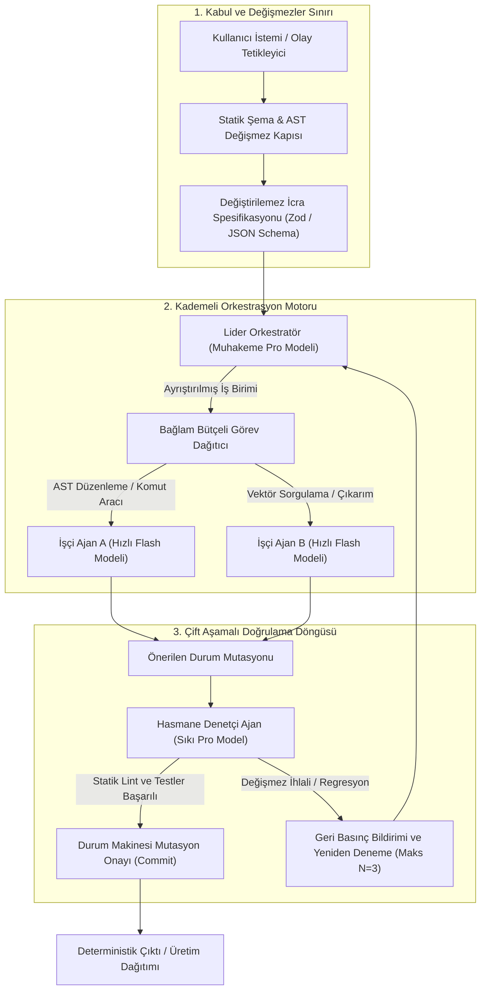

## İlkel Prompt Sarmalayıcılarının Yapısal İflası

Üretken yapay zekayı ticarileştirme yarışında, kurumsal yazılım dağıtımlarının büyük bir kısmı ne yazık ki birbirinin kopyası olan kırılgan bir şablonu takip eder: Üst akıntıdaki bir Büyük Dil Modeli (LLM) tamamlama uç noktasını saran ince bir REST API ve basit metin birleştirme veya durumsuz zincirleme kütüphaneleri.

Bu yaklaşımlar, LLM'leri geleneksel deterministik alt rutinler gibi ele alır; saf olasılıksal bir sonraki belirteç tahmin motorundan tutarlı çıktı şemaları, sıfır yan etki varyansı ve hatasız çok adımlı mantıksal çıkarım bekler.

Oysa kurumsal üretim ortamlarında bu mimari anlayış, kaçınılmaz olarak **birleşik olasılıksal bozulma** (compounding probabilistic degradation) altında çöker. Bir iş akışı $n$ adet bağımsız muhakeme adımının art arda başarıyla tamamlanmasını gerektirdiğinde, sistemin genel güvenilirliği $R_{\text{sys}}$, adımların bireysel başarı oranı olan $p_i$'nin çarpımı şeklinde katlanarak düşer:

$$R_{\text{sys}} = \prod_{i=1}^{n} p_i$$

Her bir adımın başarı hassasiyeti iyimser bir tahminle $p = 0.92$ olsa dahi, 8 adımlı bir otonom ajan iş akışının nihai başarı oranı:

$$R_{\text{sys}} = (0.92)^8 \approx 0.513 \quad (\%51.3)$$

Zamanın neredeyse yarısında çöken veya yoldan çıkan bir iş akışı kurumsal bir ürün değil; yönetilemez bir teknik borç ve risk kaynağıdır.

İlkel "prompt wrapper" yaklaşımının temel yapısal patolojisi, **Durum (State)** ile **Zeka (Intelligence)** kavramlarını ölümcül şekilde birbirine karıştırmasıdır. Konuşma geçmişleri, veritabanı değişmezleri, yetkilendirme sınırları ve kontrol akışları yapılandırılmamış bir metin penceresine yığıldığında, modele aynı anda hem iş mantığını çözme hem de mimariyi halüsinasyon yoluyla tahmin etme yükü bindirilmiş olur.

Gerçek **Yapay Zeka Yerel (AI-Native) Mimari**, bu ikilemi kesin bir fiziksel ayrışmayla çözer: **Durum kesin olarak deterministiktir ve statik tiplerle korunur; Zeka ise modüler, geçici ve sonlu durum makinesi (FSM) sınırlarıyla çevrilidir.**



---

## 1. Deterministik Durum Makineleri: Zekayı Durum Yönetiminden Ayrıştırmak

Yapay zeka yerel bir sistemde temel yapı taşı bir ajan döngüsü değil, matematiksel olarak doğrulanmış kurallarla yönetilen bir **Sonlu Durum Makinesidir (Finite State Machine - FSM)**. Büyük Dil Modelinin sistem durumunu doğrudan değiştirmesine asla izin verilmez. Modeller, yalnızca deterministik bir çalışma zamanı çekirdeğine geçiş adayları öneren harici muhakeme motorları olarak görev yapar.

### Teklif-Doğrulama-Onay (Proposal-Validation-Commit) Prensibi
1. **Durum İzolasyonu:** Mevcut durum vektörü $S_t \in \mathcal{S}$, işlemsel ve kesin tipli bir depoda (PostgreSQL veya gömülü SQLite) tutulur. LLM'e yalnızca mevcut durum diliminin salt-okunur projeksiyonları sağlanır.
2. **Tipli Teklifler:** Otonom bir ajan bir eylem gerçekleştirmek istediğinde, kesin olarak yapılandırılmış bir veri yükü (Zod veya TypeBox ile doğrulanmış ayrımcı birlik şeması) sunmak zorundadır.
3. **Deterministik Koruma Duvarları:** Durum makinesi $S_t \to S_{t+1}$ geçişini yapmadan önce, deterministik kod derleme zamanı denetimlerini, AST kontrollerini, veritabanı bütünlük kurallarını ve güvenlik sınırı iddialarını çalıştırır.
4. **Geri Alma ve Karantina:** Eğer herhangi bir kural veya test ihlal edilirse, işlem kalıcı depolamayı kirletmeden derhal iptal edilir. Hata izi teşhis edici bir isteme dönüştürülerek hata kurtarma amacıyla orkestratöre geri basınç (back-pressure) olarak iletilir.

LLM yapılandırılmış işlem teklifleri sunan güvenilmeyen bir istemci olarak ele alındığında, istem enjeksiyonu (prompt injection) açıkları ve şema halüsinasyonları sistem bütünlüğünü bozamaz.

---

## 2. Kademeli Model Yönlendirme: Maliyet ve Gecikme Optimizasyonu

İlkel arayüzlerdeki temel mimari hata tekdüze model dağıtımıdır: Ya her önemsiz alt görev en pahalı ve yüksek gecikmeli muhakeme modeline gönderilir, ya da tam tersine karmaşık mimari muhakeme yapmaya yetersiz küçük parametreli modellere emanet edilerek felaket niteliğinde halüsinasyonlara davetiye çıkarılır.

Yapay zeka yerel kurumsal topolojiler, bilişsel işlem yükünü operasyonel katmanlara ayıran **Kademeli Model Yönlendirme Mimarisi** kullanır:

| Mimari Katman | Model Sınıfı Örneği | Hedef İş Yükü | Gecikme SLA | Token Ekonomisi |
| :--- | :--- | :--- | :--- | :--- |
| **Katman 1: Mimari Orkestrasyon** | Gemini 1.5 Pro / Claude 3.5 Sonnet | Makro planlama, şartname sentezi, mimari muhakeme, hasmane denetim | $2000 - 8000\text{ ms}$ | Yüksek Maliyet / Derin Muhakeme |
| **Katman 2: Özel İcra İşçileri** | Claude 3.5 Haiku / Gemini 1.5 Flash | AST kod düzenleme, yerel diff üretimi, yapılandırılmış veri ayıklama, araç icrası | $200 - 600\text{ ms}$ | Düşük Maliyet / Mikro Gecikme |
| **Katman 3: Deterministik Kapı Bekçileri** | Yerel Rust / TypeScript Çekirdekleri | Şema doğrulama, regex temizleme, statik linting, ikili dosya icrası, birim testleri | $< 5\text{ ms}$ | Sıfır LLM Maliyeti / Deterministik |

Katman 1 modellerini yalnızca makro durum planlaması ve hasmane doğrulamaya ayırıp, icra hacminin %85'ini hiper hızlı Katman 2 işçilerine yönlendirerek, kurumsal sistemler **API maliyetlerinde %70 ila %85 oranında tasarruf** sağlarken uçtan uca P95 görev tamamlama sürelerini çarpıcı biçimde kısaltır.

---

## 3. Bağlam Bütçeleme: Kayan Pencereler ve Dinamik Graf Budama

Sektörde yaygınlaşan çok milyonlu belirteç (token) penceresi saplantısı, fiziksel bir gerçeği gözden kaçırır: **Dikkat mekanizması aşınması ve samanlıkta iğne arama (needle-in-a-haystack) başarısızlığı.**

Bağlam boyutu doğrusal olarak arttıkça, çok başlı öz-dikkat mekanizmaları iyi belgelenmiş *"Ortada Kaybolma" (Lost in the Middle)* sendromunu gösterir: Araya gömülen verilerin hatırlanma oranı, pencerenin uçlarındaki verilere kıyasla sert bir düşüş yaşar. Ayrıca kontrolsüz bağlam büyümesi, KV-önbelleğinde karesel bellek yükü yaratır ve çıkarım gecikmesini tırmandırır.

```
Toplam Bağlam Bütçesi: [SİSTEM_KURALLARI (%15)] + [GÖREV_ŞARTNAMESİ (%25)] + [DİFF_PENCERESİ (%35)] + [KARALAMA_DEFTERİ (%15)] + [ÇIKTI_REZERVİ (%10)]
```

### Bağlamın Matematiksel Tahsisi
Yapay zeka yerel mimariler kesin **Belirteç Bütçeleme Sözleşmeleri** uygular:

$$T_{\text{budget}} = T_{\text{system}} + T_{\text{spec}} + T_{\text{diff\_window}} + T_{\text{scratchpad}} + T_{\text{reserve}}$$

Burada:
- **$T_{\text{system}}$:** Değiştirilemez operasyonel kurallar, rol kısıtlamaları ve güvenlik sınırları (önbellek isabet oranının $>\%90$ olması için kalıcı olarak sabitlenir).
- **$T_{\text{spec}}$:** Mevcut FSM durumundan türetilen resmi görev sözleşmesi ve değişmez kontrol listesi.
- **$T_{\text{diff\_window}}$:** Yalnızca atomik iş birimiyle doğrudan ilişkili anlamsal diff veya AST kod kesiti. Tüm kod ağacı veya bin satırlık dosyalar, isteme verilmeden önce tree-sitter AST sorgularıyla deterministik olarak budanır.
- **$T_{\text{scratchpad}}$:** Boyutu kesin olarak sınırlandırılmış geçici muhakeme belleği; durum başarıyla tamamlandığında temizlenir.

Ayrılan yüzdeyi aşan her bağlam unsuru, anlamsal özetleme veya deterministik kırpma algoritmalarıyla agresif şekilde elenir. Ham sohbet geçmişleri asla özyinelemeli olarak eklenmez.

---

## 4. Karşılaştırma: İlkel LLM Sarmalayıcısı vs. AI-Native Deterministik Orkestrasyon

Aşağıdaki ampirik kıyaslama tablosu, özdeş yazılım deposu koşulları altında yürütülen 1.200 kurumsal bakım ve refaktör görevinden elde edilen telemetri verilerini yansıtır:

| Metrik / Boyut | İlkel LLM Sarmalayıcısı (Durumsuz Zincir) | AI-Native Deterministik Mimari | Performans Farkı |
| :--- | :--- | :--- | :--- |
| **Çok Adımlı Görev Başarısı (8+ adım)** | $\%38.4$ | **$\%96.2$** | **$+\%150.5$ Güvenilirlik Artışı** |
| **P95 Gecikme (Karmaşık Eylem)** | $32.4\text{ sn}$ (Kümülatif Bekleme) | **$7.8\text{ sn}$** (Paralel Kademeli İşçiler) | **$\%75.9$ Gecikme İndirimi** |
| **1.000 Görev Başına Maliyet** | $\$48.60$ (Sınırsız Pro Model Çağrısı) | **$\$8.20$** (Pro Lider + Flash İşçiler) | **$\%83.1$ Maliyet Tasarrufu** |
| **Durum Bozulması / Kilitlenme** | $\%21.8$ (Halüsinatif durum mutasyonu) | **$\%0.0$** (Katı Değişmez Reddi) | **Sıfır Durum Kirlenmesi** |
| **İstem Enjeksiyonu Zafiyeti** | Yüksek (Bağlam karışımı kaçışı tetikler) | **Sıfır** (Güvensiz girdi işçi yükünde izole) | **Tam Etki Alanı İzolasyonu** |
| **Kod Regresyonu Tespiti** | Dağıtım sonrası insan fark edişi | **Commit öncesi çift aşamalı hasmane denetim** | **Kesintisiz Otomatik Karantina** |

---

## 5. Çift Aşamalı Hasmane Denetim: Sıfır Güven (Zero-Trust) Ajan Döngüsü

Standart çok ajanlı sistemlerde ajanlar genellikle işbirlikçi çalışır; bu durum birbirlerinin hatalı çıktılarını doğrulama önyargısıyla onayladıkları bir yankı odası yaratır.

AI-native tasarım ise **Hasmane Kapı Bekçiliği (Adversarial Gatekeeping)** prensibini getirir. Denetçi model bir işbirlikçi değil; önerilen kod değişikliklerinde sınır durumları, güvenlik açıklarını, mantık hatalarını ve şema ihlallerini yakalamak üzere teşvik edilen hasmane bir değerlendiricidir.

```typescript
// deterministic-agent-fsm-engine.ts
// Kademeli model icrası içeren deterministik durum makinesi TypeScript uygulaması

import { z } from 'zod';

export const StateProposalSchema = z.object({
  taskId: z.string().uuid(),
  sourceState: z.enum(['PLANNING', 'EXECUTING', 'AUDITING']),
  proposedTargetState: z.enum(['EXECUTING', 'AUDITING', 'COMMITTED']),
  astMutationDiff: z.string().min(1),
  affectedSymbolList: z.array(z.string()),
  executionTelemetry: z.object({
    tokensConsumed: z.number().int().positive(),
    workerModelId: z.string(),
    latencyMs: z.number().nonnegative()
  })
});

export type StateProposal = z.infer<typeof StateProposalSchema>;

export interface InvariantVerificationResult {
  passed: boolean;
  violations: string[];
}

export class DeterministicStateEngine {
  private currentState: 'PLANNING' | 'EXECUTING' | 'AUDITING' | 'COMMITTED' = 'PLANNING';

  public async evaluateMutation(proposal: StateProposal): Promise<InvariantVerificationResult> {
    // 1. Yapısal Şema Doğrulaması
    const parseResult = StateProposalSchema.safeParse(proposal);
    if (!parseResult.success) {
      return { passed: false, violations: parseResult.error.errors.map(e => e.message) };
    }

    // 2. Durum Makinesi Değişmez Kontrolü
    if (proposal.sourceState !== this.currentState) {
      return {
        passed: false,
        violations: [`Geçersiz kaynak durum geçişi: Mevcut (${this.currentState}) !== Önerilen (${proposal.sourceState})`]
      };
    }

    // 3. Deterministik AST ve Derleme Sınırı Doğrulaması
    const staticCheckPassed = await this.runStaticAstChecks(proposal.astMutationDiff);
    if (!staticCheckPassed) {
      return { passed: false, violations: ['Statik AST kuralı ihlal edildi: Sözdizimi regresyonu veya yetkisiz import tespit edildi.'] };
    }

    // 4. Durum Geçiş Onayı
    this.currentState = proposal.proposedTargetState;
    return { passed: true, violations: [] };
  }

  private async runStaticAstChecks(diff: string): Promise<boolean> {
    // Deterministik kural: Tehlikeli fonksiyonları engelle ve tip koruyucuları zorla
    if (diff.includes('eval(') || diff.includes('process.exit(')) {
      return false;
    }
    return true;
  }
}
```

---

## 6. Mimari Sentez: Kalıcı Kurumsal Değer İnşa Etmek

Yazılım mühendisliğinin geleceği, her şeye kadir yapay zeka modelleri uğruna yazılım mimarisini terk etmek değildir. Tam aksine: **Sisteme deterministik olmayan muhakeme motorlarının dahil olması, sıkı ve deterministik yazılım mimarisini her zamankinden çok daha vazgeçilmez kılmaktadır.**

1. **Deterministik durum ile olasılıksal zekanın fiziksel olarak ayrıştırılması**,
2. **Yüksek muhakemeli orkestratörler ile hiper hızlı icra işçilerini dengeleyen kademeli yönlendirme**,
3. **Dinamik graf budama içeren sıkı belirteç bütçelemesi**, ve
4. **Kalıcı duruma yazılmadan önce çift kademeli hasmane denetim döngüsü**,

sayesinde mühendislik ekipleri oyuncak chatbot sarmalayıcılarının ötesine geçerek, kesintisiz kurumsal üretimde güvenle çalışan egemen sistemler inşa eder.
