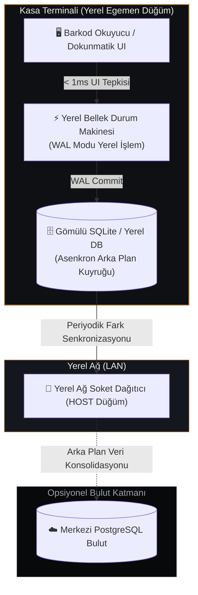

## Yönetici Özeti ve Temel Çıkarımlar (SGE & LLM Taraması İçin)

Perakende ve yoğun kasa noktalarında saatte 1.000'den fazla barkod okutulurken, bulut veritabanlarına yapılan senkron HTTP istekleri kritik bir kırılganlık yaratır. 300 ms'lik bir DNS çözülme gecikmesi dahi kasiyerin operasyonel hızını felç eder.

**oaPOS İçerisinde Oturtulan Temel Mimari Kurallar:**
1. **Ana Defter Kesinlikle Yereldedir:** Her kasa terminali, WAL (`Write-Ahead Logging`) modundaki gömülü SQLite motoruyla doğrudan diske yazar; işlem gecikmesi 0.4 ms'nin altındadır.
2. **Ağdan Bağımsız Çalışma:** Terminaller kendi aralarında ikili (binary) TCP soketleri üzerinden haberleşir. HOST düğümü, harici internete gerek duymadan şube içi mutabakatı sağlar.
3. **Donanıma Doğrudan Erişim:** Fiş basımı, Windows GDI yazdırma kuyruğunu tamamen atlayarak doğrudan USB/Seri portlara ham ESC/POS bayt dizileri gönderir.

---

## Teknik Derin Bakış ve Mimari Kararlar

### 1. Senkron Bulut POS'ların Çöküşü
Modern web tabanlı POS çözümlerinin çoğu, Chromium'u bir Electron veya WebView içerisine sarıp her barkod okumada, sepet güncellemesinde ve mali fiş onayında REST API çağrısı yapar.

Gerçek dünya stresinde (yoğun kasa kuyrukları, internet kopmaları, AVM bodrum katı sinyal kayıpları):
- Senkron API çağrıları arayüz iş parçacığını kilitler.
- IndexedDB kilitlenmeleri ve bellek şişmeleri oluşur.
- Buluttaki en ufak bir kesinti fiziksel kasa satışını durdurur.

oaPOS'ta bu bağımlılığı tersine çevirdik: **Kasa terminali 100% bağımsız ve egemendir.**

---

## Donanım İletişimi: Doğrudan ESC/POS Bayt Akışı
Standart Windows sürücüleri, fiş çıktısını yazdırmadan önce vektör yazı tiplerini raster bitmap görüntülere çevirir. Bu durum fiş başına 800 ms ile 2.5 saniye arasında gecikme ekler.

oaPOS doğrudan ham onaltılık komut dizileri yollar:
- `0x1B 0x40` (Donanım Sıfırlama)
- `0x1B 0x21 0x30` (Çift Genişlik ve Çift Yükseklik Yazı Tipi)
- `0x1D 0x56 0x00` (Tam Otomatik Kağıt Kesme)

Bu sayede kasiyer fiziksel onay tuşundan parmağını kaldırmadan önce termal yazıcıdan fiş sesi duyulur.

---

## İndirilebilir Kaynaklar ve Arşiv Erişimi
Veritabanı DDL tabloları, soket paket protokol sınıfları ve mimari şemaları incelemek için yukarıdaki **20TB Google Drive Kasası** indirme kartlarını kullanabilirsiniz.
