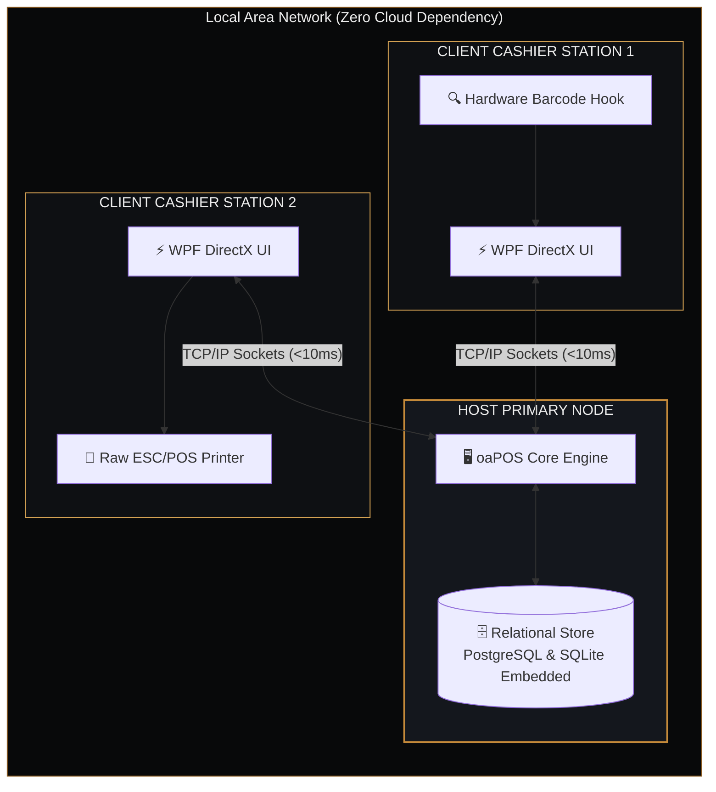

## Executive Overview

In fast-paced retail and hospitality environments, cloud-dependent Point-of-Sale (POS) systems introduce critical vulnerabilities: internet outages halt billing, high API latencies degrade checkout velocity, and recurring monthly software rents burden small-to-medium businesses.

**oaPOS** was conceived and engineered as an antidote to this vulnerability. It is a production-grade, native Windows desktop solution certified on the official Microsoft Store, engineered with an offline-first distributed architecture. By implementing a local **HOST/CLIENT socket synchronization model**, oaPOS delivers microsecond-level barcode recognition, instantaneous receipt generation, and uninterrupted store operations regardless of internet connectivity.

## System Architecture Topology

### Architectural Benchmark: oaPOS vs. Cloud-Only SaaS POS

| Performance & Operational Metric | Cloud-Only SaaS POS | Legacy On-Premise Systems | oaPOS Local-First LAN Architecture |
|---|---|---|---|
| **Checkout Latency** | 300 ms – 1500 ms (API Roundtrip) | 50 ms – 100 ms | **< 10 ms (Local Memory & Direct Sockets)** |
| **Internet Outage Impact** | Complete Terminal Blackout | Partial Functionality | **100% Autonomous Continuous Operations** |
| **Hardware Integration** | Virtual Web Print Drivers | Complex Driver Configs | **Direct Win32 Raw ESC/POS & Barcode Hooks** |
| **Data Sovereignty** | Third-Party Cloud Servers | Local Machine Only | **Local Primary Store with Seamless Multi-LAN Sync** |
| **Recurring Cost** | Expensive Monthly SaaS Subscription | High Initial Licensing | **One-Time Investment / Certified Microsoft Store** |

### 1. Zero Cloud Dependency & Local-First Resilience
Every retail transaction requires absolute guarantees. oaPOS executes all transaction logs, stock decrements, and cashier accounting directly against an optimized local transactional database (PostgreSQL cluster / SQLite Embedded with Redis memory caching). The system can run for years without ever touching an external server, guaranteeing complete privacy and zero downtime during ISP disruptions.

### 2. HOST / CLIENT Multi-Terminal LAN Synchronization
Large venues and busy supermarkets require multiple checkout stations operating concurrently. oaPOS features a proprietary LAN discovery and socket streaming protocol:
- **Host Node:** Manages the primary data ledger, fiscal reporting locks, and central inventory state.
- **Client Nodes:** Connect automatically across the local network, syncing receipt items, inventory reservations, and payment states with sub-10ms wire latency.
- **Automatic Fallback:** In the event of network disruption between stations, client terminals queue transactions locally and seamlessly reconcile via vector clocks when connectivity resumes.

### 3. Sub-10ms UI Responsiveness with WPF & Hardware Acceleration
Built on the .NET runtime with Windows Presentation Foundation (WPF), the entire user interface utilizes DirectX hardware acceleration. Barcode scanner inputs are processed via raw input hooks rather than standard keyboard buffers, eliminating input drops even during rapid item scans.

### 4. Enterprise Inventory & Fiscal Compliance
- Dynamic inventory categorisation, barcode variation hierarchies, and supplier batch tracking.
- Daily Z-report calculations, cashier end-of-day balances, and automated thermal printer dispatch via ESC/POS protocol.
- Microsoft Store certification adhering to Windows Desktop Bridge security, application sandboxing, and silent update compliance.

## Technical Stack

- **Runtime & Language:** .NET 8 / C#
- **Presentation Engine:** WPF / XAML with custom hardware-accelerated fluid controls
- **Database Engine:** PostgreSQL (multi-terminal cluster) / SQLite Embedded (autonomous node) & Redis (in-memory state)
- **Networking:** Asynchronous TCP Sockets with binary serializer protocols
- **Printing Subsystem:** Raw ESC/POS thermal command compiler (USB, Serial, Network LAN)
- **Distribution:** Windows App SDK & MSIX packaging for Microsoft Store

## Business Impact

By eliminating cloud monthly subscriptions and protecting store owners against ISP outages, oaPOS delivers an estimated **99.999% checkout availability** across retail deployments, zero software recurring operational fees, and measurable cashier queue reduction during peak hours.
