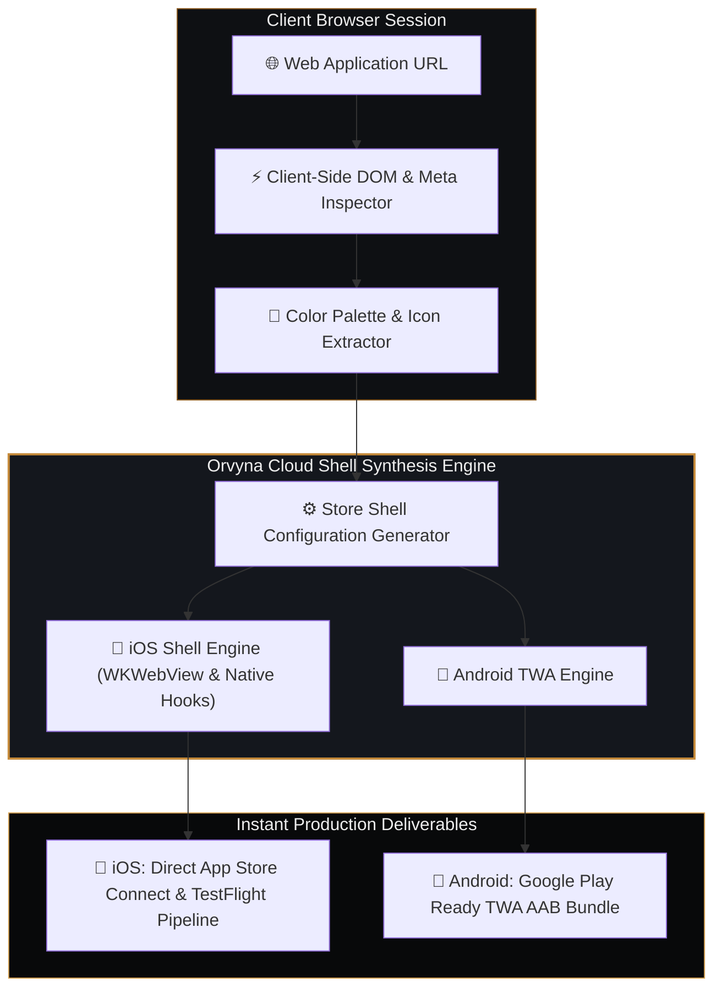

## Executive Overview

Modern web applications frequently deliver desktop- and mobile-grade experiences, yet distributing them into official mobile app stores often requires cumbersome cross-platform frameworks (React Native, Flutter, Cordova), duplicate codebases, and continuous compilation pipeline overhead.

**Orvyna App Studio** is not merely a PWA generator; it is an automated web2app compilation platform designed for real store delivery. On iOS, Orvyna integrates directly with the Apple App Store Connect API to automate builds straight into **TestFlight**. On Android, it synthesizes production-ready **Google Play Trusted Web Activity (TWA) AAB** bundles with sub-150KB shell footprints in under 3 seconds.

## System Architecture Topology

### Architectural Benchmark: Orvyna Native Store Engine vs. Alternatives

| Architecture Metric | Standard Browser PWA | Heavy WebView Wrappers | Orvyna Native Store Engine |
|---|---|---|---|
| **iOS Distribution** | Safari 'Add to Home' Only (No Store) | Complex Xcode/Mac Build Required | **Direct App Store Connect & TestFlight Pipeline** |
| **Android Distribution** | WebAPK (Limited Play presence) | Heavy APK (20 MB – 50 MB) | **Google Play Ready TWA AAB Bundle** |
| **Shell Footprint** | Browser Cache Dependent | 15 MB – 40 MB | **< 150 KB Lightweight Native Shell** |
| **Compilation Latency** | Manual Config (Hours) | 5 – 15 Minutes | **< 3 Seconds Automated Synthesis** |
| **Update Cycle** | Manual Cache Invalidation | Full App Store Review Cycle | **Instant Web-Pushed Updates** |

### 1. Zero-Friction Web-to-Store Compilation
Developers enter their responsive web URL; Orvyna automatically inspects the remote DOM tree, extracts relevant favicons, OpenGraph imagery, and meta definitions, and configures native store wrapper specifications for iOS and Android in real time.

### 2. High-Performance Shell & Native Bridge Hooks
Unlike heavy webview wrappers that suffer from memory bloat and scroll stutter, Orvyna produces a lightweight shell (under 150 KB). It integrates:
- **Intelligent Cache Strategies:** Network-first with stale-while-revalidate fallbacks for offline-ready continuity.
- **Hardware Integration:** Deep integration with device navigation, Android hardware back buttons, iOS safe-area insets, and status bar theming.
- **Push Notification Stubs:** Ready-to-connect native push notification adapters for Firebase Cloud Messaging and Apple APNs.

### 3. Direct Store Delivery Pipeline
Operating directly within the modern browser sandbox via Web Streams and API integrations, users can configure, test, and dispatch their apps directly to Apple App Store Connect / TestFlight for iOS and generate production-ready Google Play TWA AAB bundles without exposing proprietary source code to third-party build servers.

## Technical Stack

- **Core Engine:** TypeScript, Vite, Web Components
- **iOS Automation:** Apple App Store Connect API & TestFlight pipeline
- **Android Delivery:** Google Play Trusted Web Activity (TWA) AAB engine
- **Caching & Offline:** Workbox Service Worker engine
- **Interface:** Tailwind CSS, Obsidian/Gold bespoke UI system
- **Export Formats:** Apple App Store Connect / TestFlight API automation, Android Google Play TWA AAB

## Real-World Outcomes

Orvyna eliminates days of boilerplate setup for developers looking to publish high-converting mobile apps to official app stores. It delivers direct TestFlight pipelines for iOS and Google Play AAB bundles for Android, reducing application footprint by over 90% while preserving 100% web velocity.
