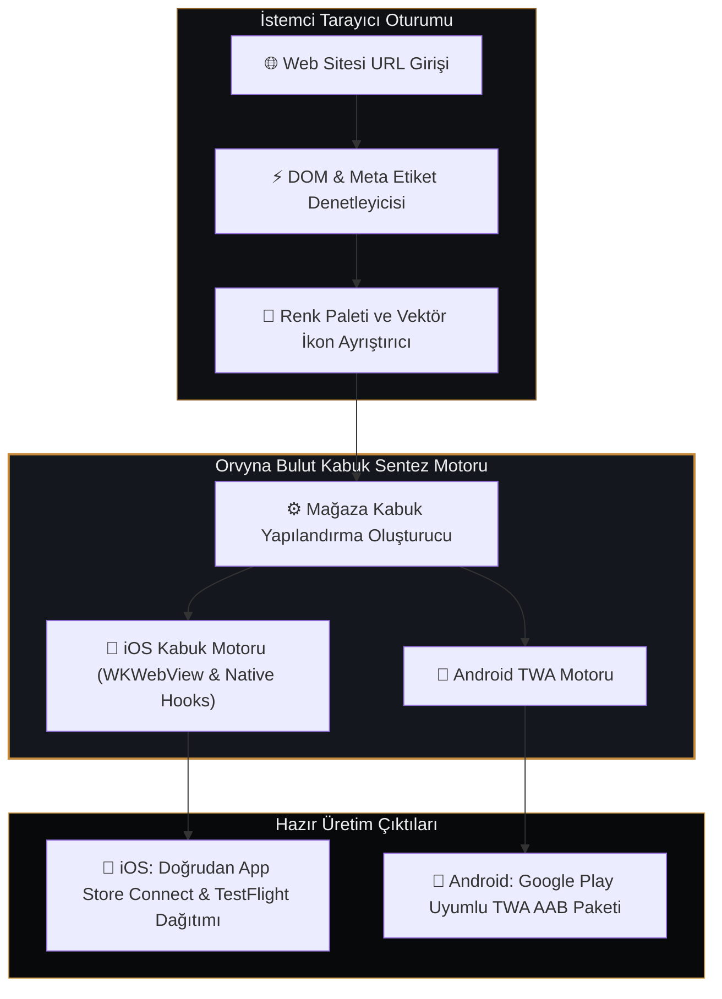

## Projeye Genel Bakış

Günümüz modern web uygulamaları masaüstü ve mobil kalitesinde kullanıcı deneyimi sunabilmektedir. Ancak bu web projelerini yerel uygulama mağazalarında sunmak, geleneksel çapraz platform araçlarıyla (React Native, Flutter, Cordova vb.) kod tabanını ikiye katlamayı ve karmaşık derleme süreçlerini zorunlu kılar.

**Orvyna App Studio**, basit bir PWA aracı değildir; doğrudan mağaza dağıtımı sağlayan bulut tabanlı bir web2app üretim stüdyosudur. iOS tarafında doğrudan **Apple App Store Connect API** entegrasyonuyla derlemeleri doğrudan **TestFlight**'a iletir; Android tarafında ise saniyeler içinde **Google Play uyumlu TWA AAB** paketleri ve 150 KB altı ultra hafif yerel kabuklar üretir.

## Sistem Mimarisi Topolojisi

### Mimari Karşılaştırma: Orvyna Yerel Mağaza Motoru ve Alternatifleri

| Mimari Kriter | Standart Tarayıcı PWA | Ağır WebView Sarmalayıcıları | Orvyna Yerel Mağaza Motoru |
|---|---|---|---|
| **iOS Dağıtımı** | Yalnızca Safari 'Ana Ekrana Ekle' | Karmaşık Xcode/Mac Derlemesi Gerekir | **Doğrudan App Store Connect & TestFlight Dağıtımı** |
| **Android Dağıtımı** | WebAPK (Sınırlı Mağaza Görünürlüğü) | Ağır APK (20 MB – 50 MB) | **Google Play Uyumlu TWA AAB Paketi** |
| **Kabuk Boyutu** | Tarayıcı Önbelleğine Bağımlı | 15 MB – 40 MB | **< 150 KB Ultra Hafif Yerel Kabuk** |
| **Derleme Süresi** | Manuel Yapılandırma (Saatler) | 5 – 15 Dakika | **< 3 Saniye Otomatik Sentez** |
| **Güncelleme Döngüsü** | Manuel Önbellek Temizleme | Mağaza İnceleme Süreci Zorunlu | **Web Üzerinden Anında Güncelleme** |

### 1. Sürtünmesiz Web'den Yerel Mağazaya Dönüşüm
Geliştiriciler yalnızca sitelerinin URL adresini girer; Orvyna uzak sayfa yapısını anında analiz eder, yüksek çözünürlüklü ikonları, renk temalarını ve OpenGraph meta etiketlerini ayıklar; iOS ve Android yerel mağaza kabuk tanımlamalarını otomatik oluşturur.

### 2. Yüksek Performanslı ve Hafif Kabuk Mimarisi
Bellek tüketen ve kaydırma gecikmelerine neden olan ağır webview sarmalayıcılarının aksine, Orvyna 150 KB altı ultra hafif bir kabuk üretir:
- **Akıllı Önbellekleme:** Network-first ve stale-while-revalidate stratejileriyle kesintisiz çevrimdışı çalışma kabiliyeti.
- **Donanım Uyumu:** Android fiziksel geri tuşu yönetimi, iOS güvenli alan (safe-area) sınırları ve durum çubuğu renklendirmesi.
- **Bildirim Altyapısı:** Firebase Cloud Messaging ve Apple APNs yerel bildirimleri için hazır bağlantı arayüzleri.

### 3. Doğrudan Mağaza Dağıtım Hattı
Tüm süreç tarayıcı kum havuzunda yürütülür; iOS tarafında doğrudan Apple App Store Connect ve TestFlight API entegrasyonuyla dağıtım başlatılır, Android için ise Google Play uyumlu TWA AAB paketleri üçüncü taraf derleme sunucularına kaynak kod iletmeden üretilir.

## Teknoloji Yığını

- **Çekirdek Motor:** TypeScript, Vite, Modern Web Components
- **iOS Otomasyonu:** Apple App Store Connect API & TestFlight dağıtım hattı
- **Android Dağıtımı:** Google Play Güvenilir Web Etkinliği (TWA) AAB motoru
- **Önbellek & Çevrimdışı:** Workbox Service Worker
- **Tasarım:** Tailwind CSS, Obsidian & Tungsten Gold arayüz token'ları
- **Çıktı Formatları:** Apple App Store Connect / TestFlight API otomasyonu, Android Google Play TWA AAB

## Sağlanan Faydalar

Orvyna, web projelerini resmi mobil mağazalara taşımak isteyen ekipler için haftalar süren boilerplate konfigürasyonunu ortadan kaldırır. iOS için doğrudan TestFlight dağıtımı, Android için Google Play AAB paketleri sunarak uygulama boyutunu %90'ın üzerinde azaltır ve web geliştirme hızını korur.
